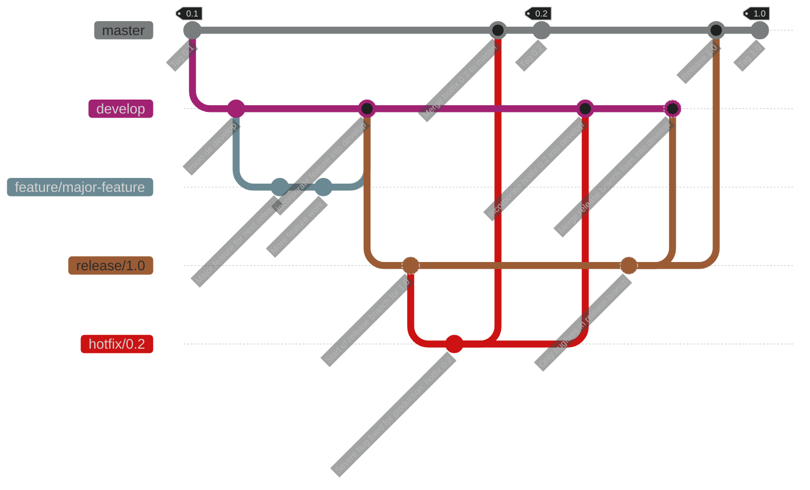
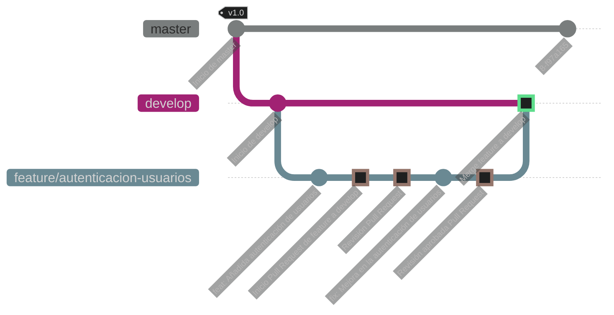
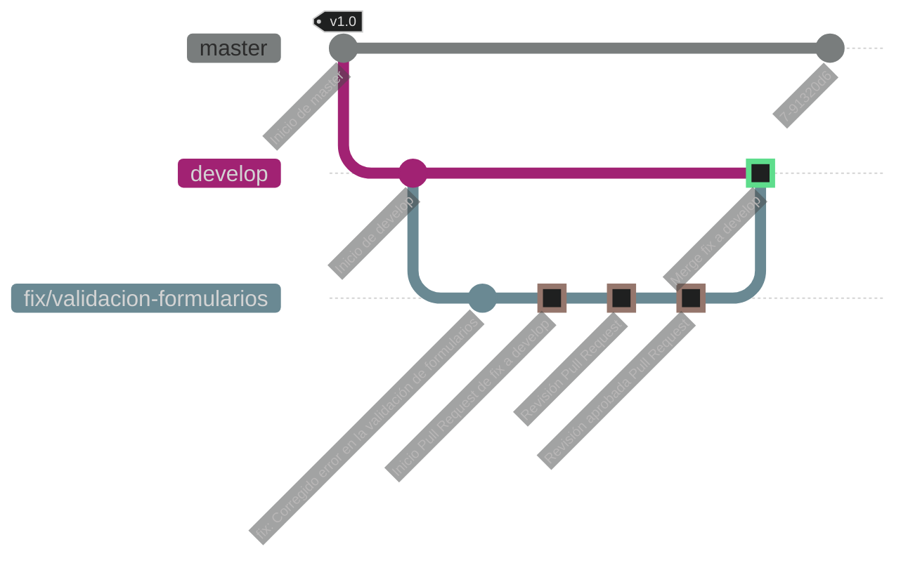

# Model Branching

El modelo de branching o ramificación es una estrategia en Git que define cómo se crean, se usan y se combinan las ramas en un proyecto.

## Git Flow

Git Flow es una de las metodologías de branching más populares en Git. Proporciona un marco de trabajo para administrar proyectos más grandes con varias versiones y características en desarrollo simultáneamente. Git Flow utiliza una estructura de ramas consistente que incluye

## Branches Principales:

- ```main```: Contiene el código de producción. Este branch siempre debe estar en un estado estable y listo para ser desplegado.
- ```develop```: Contiene el código más reciente para el próximo release. Aquí es donde se integran todas las nuevas funcionalidades y correcciones antes de ser promovidas a ```main```.

## Branches de Soporte:

- ```feature/*```: Para el desarrollo de nuevas funcionalidades. Cada nueva funcionalidades tiene su propio branch.
- ```release/*```: Para preparar nuevas versiones. Una vez que ```develop``` está listo para un nuevo release, se crea un branch de release para finalizar el trabajo antes de fusionarlo con ```main``` y ```develop```.
- ```hotfix/*```: Para correcciones críticas en ```main```. Los hotfixes se aplican directamente a ```main``` y luego se fusionan de nuevo en ```develop```.
- ```fix/*```: Para corrección de errors. Cada nuevo error encontrado si su propio branch.

 ## Convenciones de Merge y Commit

- ```Merge Request Contexts```: develop, test, master.
- ```Naming Convention```: ``` <type>/<issue_number>_<alias> ```.
- ```Commit Conventions```: Basado en convenciones comunes, por ejemplo:

```commit -m "<type>[optional scope]: <description>"```

## Ejemplos de **type**:
 
- ```feat```: Nueva característica.
- ```fix```: Corrección de errores.
- ```docs```: Cambios en la documentación.
- ```style```: Cambios de formato.
- ```refactor```: Refactorización de código.
- ```test```: Añadir o corregir pruebas.




## Implementación del Modelo de Branching##

Basado en la información y ejemplos proporcionados, aquí está un modelo detallado de branching para el equipo:

1. Branches Principales
    - ```master```: Código listo para producción.
    - ```develop```: Código para la próxima versión.

2. Branches de Soporte
 
    - ```feature/*```: Nuevas funcionalidades.
    - ```fix/*```: Correcciones de errores.
    - ```release/*```: Preparación de versiones.
    - ```hotfix/*```: Correcciones críticas en producción.

3. Flujo de Trabajo
 
    1. Crear una nueva funcionalidad o corrección:   
        ```shell
            git checkout develop
            git pull origin develop
            git checkout -b feature/123_mi-nueva-caracteristica
            git checkout -b fix/435_mi-correccion
        ```
    2. Trabajar y hacer commits siguiendo las convenciones:
        ```shell
            commit -m "feat: Añadida nueva funcionalidad X"
            # o
            commit -m "fix: Corregido error en el módulo Y" 
        ```    

    3. Trabajar y hacer commits siguiendo las convenciones:
        ```shell
            git checkout develop
            git pull origin develop
            git merge --no-ff feature/123_mi-nueva-caracteristica
            git push origin develop
            # o
            git merge --no-ff fix/435_mi-correccion
            git push origin develop
        ```   

    4. Preparar y finalizar un release:
        ```shell
            git checkout develop
            git pull origin develop
            git checkout -b release/v1.0.0

            # Realizar pruebas y ajustes necesarios

            git checkout test
            git pull origin test
            git merge --no-ff release/v1.0.0
            git push origin test

            git checkout master
            git pull origin master
            git merge --no-ff release/v1.0.0
            git tag -a v1.0.0 -m "Release v1.0.0"
            git push origin master
            git push origin --tags

            git checkout develop
            git pull origin develop
            git merge --no-ff release/v1.0.0
            git push origin develop
        ```    

    
    5. Aplicar un hotfix:
        ```shell
            git checkout master
            git pull origin master
            git checkout -b hotfix/v1.0.1

            # Realizar corrección

            git checkout master
            git pull origin master
            git merge --no-ff hotfix/v1.0.1
            git tag -a v1.0.1 -m "Hotfix v1.0.1"
            git push origin master
            git push origin --tags

            git checkout develop
            git pull origin develop
            git merge --no-ff hotfix/v1.0.1
            git push origin develop
        ```   

## Convenciones de Commits##

Utiliza convenciones estandarizadas para los mensajes de commit:

```commit -m "<type>[optional scope]: <description>"```

# Ejemplos de type:

   - ```feat```: Nueva característica.
   - ```fix```: Corrección de errores.
   - ```docs```: Cambios en la documentación.
   - ```style```: Cambios de formato.
   - ```refactor```: Refactorización de código.
   - ```test```: Añadir o corregir pruebas.

## Ejemplo Práctico: Creación de una Rama de Feature

Supongamos que estamos trabajando en un proyecto llamado mi-proyecto y necesitamos añadir una nueva funcionalidad llamada "autenticación de usuarios". A continuación se detallan los pasos:

1. ## Clonar el repositorio y navegar al proyecto

    Si aún no tienes el repositorio clonado, hazlo con el siguiente comando:

    ```shell
       git clone https://github.com/usuario/mi-proyecto.git 
       cd mi-proyecto
    ```
2. ## Crear una nueva rama de feature
   
    Primero, asegúrate de estar en la rama develop y de tener la última versión:

    ```shell 
       git checkout develop
       git pull origin develop
    ```

    Luego, crea una nueva rama para la característica:
   
    ```shell 
       git checkout -b feature/autenticacion-usuarios
    ```

3. ## Realizar cambios y hacer commits

    Haz los cambios necesarios en el código. Por ejemplo, podrías añadir un nuevo módulo de autenticación.
    Luego, realiza los commits siguiendo las convenciones. Por ejemplo:
    
    ```shell 
       git add .
       git commit -m "feat: Añadido módulo de autenticación de usuarios"
    ```

    Si realizas más cambios, asegúrate de describir adecuadamente cada commit:

     ```shell 
       git add .
       git commit -m "fix: Corregido error en la validación de tokens"
    ```

4. ## Subir la rama a remoto
 
    Para compartir tu trabajo y que otros puedan revisarlo, sube la rama al repositorio remoto:
    
    ```shell 
       git push origin feature/autenticacion-usuarios
    ```

5. ## Crear un Merge Request (MR)  
 
    Ve a tu plataforma de gestión de repositorios (como GitHub, GitLab, Bitbucket) y crea un Merge Request (MR) desde la rama  ```feature/autenticacion-usuarios ``` hacia  ```develop ```.

6. ## Revisar y fusionar la rama
    
    Una vez aprobado el MR, fusiona la rama de feature en develop. Esto puede hacerse desde la interfaz web de tu plataforma de repositorios o mediante comandos de Git. Desde la línea de comandos:
 
    ```shell 
       git checkout develop
       git pull origin develop
       git merge --no-ff feature/autenticacion-usuarios
       git push origin develop
    ```




# Ejemplo Práctico: Creación de una Rama de Fix

Supongamos que estamos trabajando en un proyecto llamado mi-proyecto y necesitamos corregir un error en la validación de formularios. A continuación se detallan los pasos:

1. ## Clonar el repositorio y navegar al proyecto
    
    Si aún no tienes el repositorio clonado, hazlo con el siguiente comando:

    ```shell 
       git clone https://github.com/usuario/mi-proyecto.git
       cd mi-proyecto
    ```

2. ## Clonar el repositorio y navegar al proyecto
    
    Crear una nueva rama de fix
    Primero, asegúrate de estar en la rama ```develop``` y de tener la última versión:

    ```shell 
       git checkout develop
       git pull origin develop
    ```

    Luego, crea una nueva rama para la corrección:

    ```shell 
       git checkout -b fix/validacion-formularios
    ```

3. ## Clonar el repositorio y navegar al proyecto
    
    Crear una nueva rama de fix
    Primero, asegúrate de estar en la rama ```develop``` y de tener la última versión:

    ```shell 
       git checkout develop
       git pull origin develop
    ```

4. ##  Realizar cambios y hacer commits
    Haz los cambios necesarios en el código para corregir el error.
    Luego, realiza los commits siguiendo las convenciones. Por ejemplo:

    ```shell 
       git add .
       git commit -m "fix: Corregido error en la validación de formularios"
    ```

5. ## Crear un Merge Request (MR)
    Ve a tu plataforma de gestión de repositorios (como GitHub, GitLab, Bitbucket) y crea un Merge Request (MR) desde la rama fix/validacion-formularios hacia ```develop```.

6. ## Revisar y fusionar la rama
 
    Una vez aprobado el MR, fusiona la rama de fix en ```develop```. Esto puede hacerse desde la interfaz web de tu plataforma de repositorios o mediante comandos de Git. Desde la línea de comandos:    
 
    ```shell 
       git checkout develop
       git pull origin develop
       git merge --no-ff fix/validacion-formularios
       git push origin develop
    ```



## ¿Te gusta el contenido que comparto? Invítame un café para ayudarme a seguir creando. ¡Gracias por tu apoyo!
[](https://buymeacoffee.com/malbarracin)
